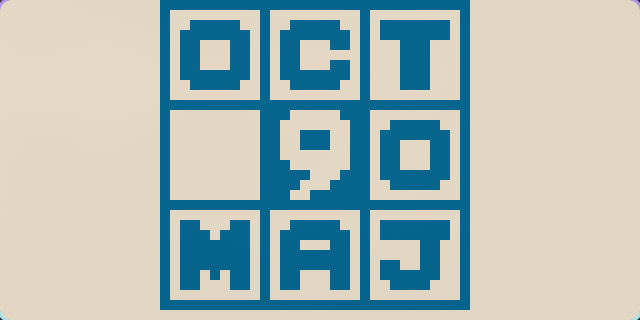

# CHIP-8 Emulator in C

A simple CHIP-8 emulator written in C using the modern SDL3 library for graphics, audio, and input.



---

## About The Project

This project is a clean-room implementation of a CHIP-8 interpreter. The architecture is designed to be simple and modular, with a clear separation between the core emulation logic and the platform-specific layer (SDL3).

### Features

- Full CHIP-8 instruction set emulation
- 64x32 monochrome display rendering via SDL3 Texture Streaming
- 16-key hexadecimal keypad input handling
- Timer and sound support
- Makefile-based build system for Linux and other Unix-like systems
- Editor-aware configuration via `compile_commands.json` for accurate IntelliSense
- Strict and consistent code style enforced by `clang-format`

### Built With

- [C](<https://en.wikipedia.org/wiki/C_(programming_language)>)
- [SDL3](https://wiki.libsdl.org/)
- [GNU Make](https://www.gnu.org/software/make/)
- [Clang](https://clang.llvm.org/)
- [Bear](https://github.com/rizsotto/Bear)

---

## Getting Started

To get a local copy up and running, follow these steps.

### Prerequisites

A C toolchain, the SDL3 development library, and Bear must be installed.

#### Linux

- **On Arch Linux:**
  ```sh
  sudo pacman -S clang base-devel sdl3 bear
  ```
- **On Debian/Ubuntu:**
  _(Note: SDL3 may require building from source or using a PPA if not in the main repositories.)_
  ```sh
  sudo apt-get install clang build-essential libsdl3-dev bear
  ```

#### Windows

The recommended way to set up a development environment on Windows is with **MSYS2**.

1.  **Install MSYS2:** Download and install MSYS2 from the [official website](https://www.msys2.org/).

2.  **Open the MSYS2 MINGW64 Terminal:** From the Start Menu, launch the "MSYS2 MINGW64" shell (not the default "MSYS2 MSYS").

3.  **Install Development Tools:** Inside the MINGW64 terminal, use the `pacman` package manager to install the necessary toolchain, libraries, and tools.

    ```sh
    # Update package databases
    pacman -Syu

    # Install the Mingw-w64 toolchain (includes clang, make, etc.) and SDL3
    pacman -S --needed mingw-w64-x86_64-toolchain mingw-w64-x86_64-clang mingw-w64-x86_64-sdl3 mingw-w64-x86_64-bear
    ```

All subsequent commands should be run from within the **MSYS2 MINGW64 terminal**.

### Building the Project

1.  **Clone the repository:**

    ```sh
    git clone https://github.com/francis1009/chip8-emulator-c.git
    cd chip8-emulator-c
    ```

2.  **Generate `compile_commands.json`:**
    This step configures the editor's language server. It only needs to be run once, or whenever source files are added or removed.

    ```sh
    bear -- make debug
    ```

3.  **Build the emulator:**
    This creates the executable at `bin/chip8_debug`.
    ```sh
    make debug
    ```

---

## Usage

The emulator is run from the command line using the provided `Makefile` targets.

- **Run with the default ROM (PONG):**

  ```sh
  make run-debug
  ```

- **Run with a specific ROM:**
  The `ROM` variable should be the filepath to the ROM. The program automatically searches in the `roms/` directory.
  ```sh
  make run-debug ROM=chip8/octojam9title.ch8
  ```

---

## Development

This project uses `clang-format` to maintain a consistent code style. The rules are defined in the `.clang-format` file. If you have format-on-save configured in your editor, it will be applied automatically.

---

## Acknowledgments

This project would not have been possible without the excellent resources provided by the community. The architecture and implementation were heavily guided by the following:

- **Tobias V. Langhoff's Blog - [Guide to making a CHIP-8 emulator ](https://tobiasvl.github.io/blog/write-a-chip-8-emulator/):** Provided a clear, high-level overview of the CHIP-8 architecture and a fantastic reference for the main emulation loop structure.
- **Laurence Muller's Emulator Guide - [How to write an emulator (CHIP-8 interpreter)](https://multigesture.net/articles/how-to-write-an-emulator-chip-8-interpreter/):** An invaluable resource for detailed, step-by-step explanations of the Chip-8 emulator and the system's inner workings.
- **Timendus's CHIP-8 Test Suite - [chip8-test-suite](https://github.com/Timendus/chip8-test-suite):** The definitive test suite for verifying the correctness of an emulator's opcode implementations.
- **John Earnest's Chip-8 Archive - [chip8Archive](https://johnearnest.github.io/chip8Archive/):** An essential collection of public domain ROMs used for testing and demonstration.
- **The Official SDL Wiki - [wiki.libsdl.org](https://wiki.libsdl.org/):** The primary source of documentation for the SDL3 library, essential for implementing the graphics, input, and audio platform layer.
